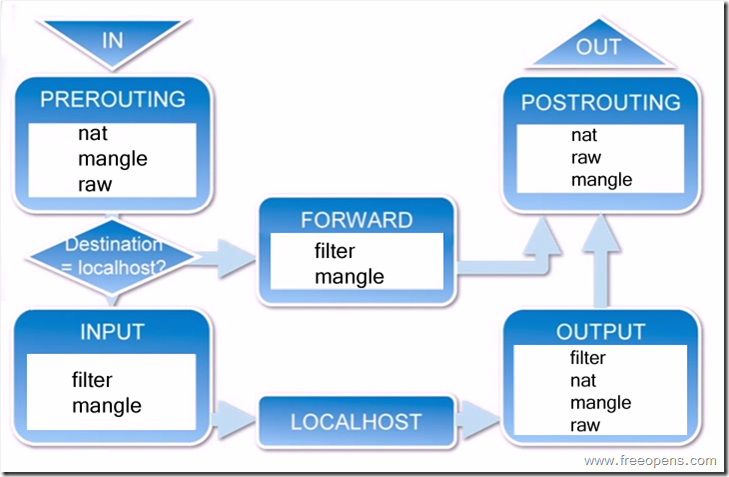
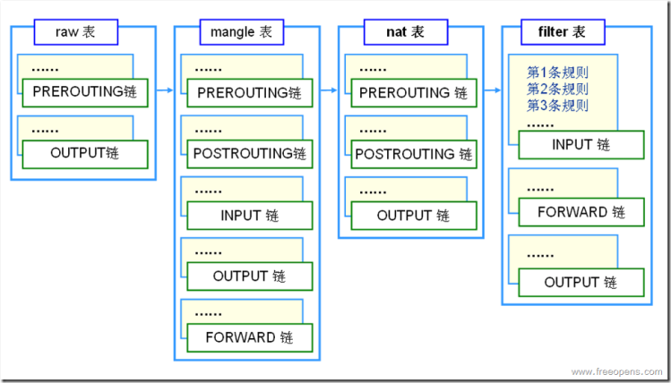

# iptables

## iptables简介

netfilter/iptables（简称为iptables）组成Linux平台下的包过滤防火墙，与大多数的Linux软件一样，这个包过滤防火墙是免费的，它可以代替昂贵的商业防火墙解决方案，完成封包过滤、封包重定向和网络地址转换（NAT）等功能。

## iptables基础

规则（rules）其实就是网络管理员预定义的条件，规则一般的定义为“如果数据包头符合这样的条件，就这样处理这个数据包”。规则存储在内核空间的信息 包过滤表中，这些规则分别指定了源地址、目的地址、传输协议（如TCP、UDP、ICMP）和服务类型（如HTTP、FTP和SMTP）等。当数据包与规 则匹配时，iptables就根据规则所定义的方法来处理这些数据包，如放行（accept）、拒绝（reject）和丢弃（drop）等。配置防火墙的 主要工作就是添加、修改和删除这些规则。

## iptables和netfilter的关系：

这是第一个要说的地方，Iptables和netfilter的关系是一个很容易让人搞不清的问题。很多的知道iptables却不知道 netfilter。其实iptables只是Linux防火墙的管理工具而已，位于/sbin/iptables。真正实现防火墙功能的是 netfilter，它是Linux内核中实现包过滤的内部结构。

## iptables传输数据包的过程

1. 当一个数据包进入网卡时，它首先进入PREROUTING链，内核根据数据包目的IP判断是否需要转送出去。 
2. 如果数据包就是进入本机的，它就会沿着图向下移动，到达INPUT链。数据包到了INPUT链后，任何进程都会收到它。本机上运行的程序可以发送数据包，这些数据包会经过OUTPUT链，然后到达POSTROUTING链输出。 
3. 如果数据包是要转发出去的，且内核允许转发，数据包就会如图所示向右移动，经过FORWARD链，然后到达POSTROUTING链输出。
  

## iptables的规则表和链：

表（tables）提供特定的功能，iptables内置了4个表，即filter表、nat表、mangle表和raw表，分别用于实现包过滤，网络地址转换、包重构(修改)和数据跟踪处理。
链（chains）是数据包传播的路径，每一条链其实就是众多规则中的一个检查清单，每一条链中可以有一 条或数条规则。当一个数据包到达一个链时，iptables就会从链中第一条规则开始检查，看该数据包是否满足规则所定义的条件。如果满足，系统就会根据 该条规则所定义的方法处理该数据包；否则iptables将继续检查下一条规则，如果该数据包不符合链中任一条规则，iptables就会根据该链预先定 义的默认策略来处理数据包。

Iptables采用“表”和“链”的分层结构。注意一定要明白这些表和链的关系及作用。

## 规则表：

1.filter表——三个链：INPUT、FORWARD、OUTPUT
作用：过滤数据包  内核模块：iptables_filter.
2.Nat表——三个链：PREROUTING、POSTROUTING、OUTPUT
作用：用于网络地址转换（IP、端口） 内核模块：iptable_nat
3.Mangle表——五个链：PREROUTING、POSTROUTING、INPUT、OUTPUT、FORWARD
作用：修改数据包的服务类型、TTL、并且可以配置路由实现QOS内核模块：iptable_mangle(别看这个表这么麻烦，咱们设置策略时几乎都不会用到它)
4.Raw表——两个链：OUTPUT、PREROUTING
作用：决定数据包是否被状态跟踪机制处理  内核模块：iptable_raw

## 规则链：

1.INPUT——进来的数据包应用此规则链中的策略
2.OUTPUT——外出的数据包应用此规则链中的策略
3.FORWARD——转发数据包时应用此规则链中的策略
4.PREROUTING——对数据包作路由选择前应用此链中的规则
（记住！所有的数据包进来的时侯都先由这个链处理）
5.POSTROUTING——对数据包作路由选择后应用此链中的规则
（所有的数据包出来的时侯都先由这个链处理）

## 规则表之间的优先顺序：

Raw——mangle——nat——filter

## 规则链之间的优先顺序（分三种情况）：

### 第一种情况：入站数据流向

从外界到达防火墙的数据包，先被PREROUTING规则链处理（是否修改数据包地址等），之后会进行路由选择（判断该数据包应该发往何处），如果数据包 的目标主机是防火墙本机（比如说Internet用户访问防火墙主机中的web服务器的数据包），那么内核将其传给INPUT链进行处理（决定是否允许通 过等），通过以后再交给系统上层的应用程序（比如Apache服务器）进行响应。

### 第二种情况：转发数据流向

来自外界的数据包到达防火墙后，首先被PREROUTING规则链处理，之后会进行路由选择，如果数据包的目标地址是其它外部地址（比如局域网用户通过网 关访问QQ站点的数据包），则内核将其传递给FORWARD链进行处理（是否转发或拦截），然后再交给POSTROUTING规则链（是否修改数据包的地 址等）进行处理。

### 第三种情况：出站数据流向

防火墙本机向外部地址发送的数据包（比如在防火墙主机中测试公网DNS服务器时），首先被OUTPUT规则链处理，之后进行路由选择，然后传递给POSTROUTING规则链（是否修改数据包的地址等）进行处理。

## SNAT和DNAT

SNAT是指在数据包从网卡发送出去的时候，把数据包中的源地址部分替换为指定的IP，这样，接收方就认为数据包的来源是被替换的那个IP的主机
DNAT，就是指数据包从网卡发送出去的时候，修改数据包中的目的IP，表现为如果你想访问A，可是因为网关做了DNAT，把所有访问A的数据包的目的IP全部修改为B，那么，你实际上访问的是B
因为，路由是按照目的地址来选择的，因此，DNAT是在PREROUTING链上来进行的，而SNAT是在数据包发送出去的时候才进行，因此是在POSTROUTING链上进行的。
通过snat和dnat可以使内网和外网进行相互通讯。

## iptables的基本语法格式

iptables [-t 表名] 命令选项 ［链名］ ［条件匹配］ ［-j 目标动作或跳转]
-t 指定规则表，默认filter表

### iptables命令的管理控制选项

-A 在指定链的末尾添加（append）一条新的规则
-D 删除（delete）指定链中的某一条规则，可以按规则序号和内容删除
-I 在指定链中插入（insert）一条新的规则，默认在第一行添加
-R 修改、替换（replace）指定链中的某一条规则，可以按规则序号和内容替换
-L 列出（list）指定链中所有的规则进行查看
-E 重命名用户定义的链，不改变链本身
-F 清空（flush）
-N 新建（new-chain）一条用户自己定义的规则链
-X 删除指定表中用户自定义的规则链（delete-chain）
-P 设置指定链的默认策略（policy）
-Z 将所有表的所有链的字节和数据包计数器清零
-n 使用数字形式（numeric）显示输出结果

### 防火墙处理数据包的四种方式

ACCEPT 允许数据包通过
DROP 直接丢弃数据包，不给任何回应信息
REJECT 拒绝数据包通过，必要时会给数据发送端一个响应的信息。
LOG在/var/log/messages文件中记录日志信息，然后将数据包传递给下一条规则

## 常用指令

iptables -t filter -A INPUT -p tcp -j ACCEPT
iptables -I INPUT -p udp -j ACCEPT
iptables -I INPUT 2 -p icmp -j ACCEPT
iptables -P INPUT DROP
iptables -L INPUT --line-numbers
iptables -t nat -F 
iptables -t  nat -A  POSTROUTING -s 192.168.1.0/24 -o eth0  -j  SNAT --to-source 202.100.1.1
iptables -t nat -A PREROUTING -d 192.168.1.51 -p tcp -m tcp --dport 80 -j DNAT --to-destination  192.168.122.2:80

## iptables防火墙规则的保存与恢复

1、iptables-save > /etc/iptables  #保存iptables的规则，避免开机失效
2、vi  /etc/network/interfaces  编辑网卡，写入开机加载iptables规则
3、 iptables-restore < /etc/iptables  在网卡配置文件中写入加载 之前保存的规则文件 使其开机可以加载iptables的规则文件

参考：
http://www.cnblogs.com/metoy/p/4320813.html
http://blog.csdn.net/ixidof/article/details/5764903